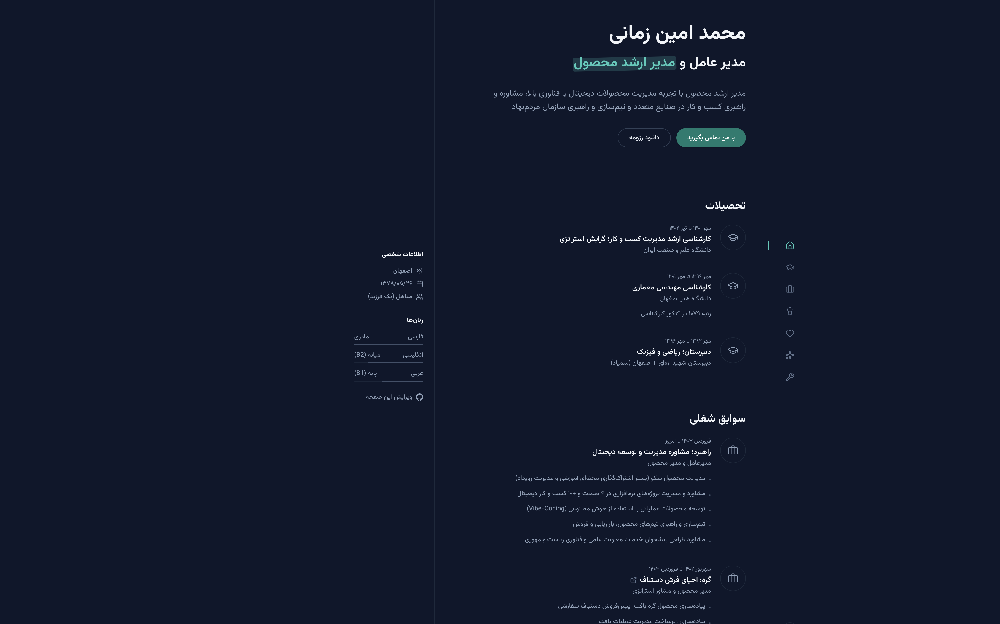

# CVFA - Persian CV Template for Next.js

A Persian (RTL) resume template built with Next.js — customize your CV by editing a single JSON file.

**Live demo:** [mazamani.ir](https://mazamani.ir)  
**Repository:** [github.com/maazamaani/cvfa](https://github.com/maazamaani/cvfa)



## Features

- Persian UI with right-to-left layout
- Light / dark theme
- Responsive (mobile and desktop)
- All content driven by one JSON file
- PDF download with theme preserved and smart page breaks for cards
- “Edit this page” link to edit `data/cv.json` on GitHub
- Deploy with npm or Docker

## Quick start

### Prerequisites

- Node.js 20+
- npm

or

- Docker and Docker Compose

---

## Option 1 — npm (local dev and direct deploy)

### Install and run

```bash
git clone https://github.com/maazamaani/cvfa.git
cd cvfa
npm install
npm run dev
```

Open [http://localhost:3000](http://localhost:3000)

### Production

```bash
npm run build
npm start
```

---

## Option 2 — Docker Compose

On every push to `main`, GitHub Actions builds and publishes the image to Docker Hub:

`maazamaani/cvfa:latest`

`docker-compose.yml`:

```yaml
services:
  cvfa:
    container_name: cvfa
    image: ${CVFA_IMAGE:-maazamaani/cvfa:latest}
    pull_policy: always
    ports:
      - "12345:3000"
    volumes:
      - ./data:/app/data
    restart: always
```

### Run

```bash
mkdir -p data
# If you don't have data/cv.json yet, copy it from the repo:
# cp /path/to/cvfa/data/cv.json data/cv.json

docker compose pull
docker compose up -d
```

Open [http://localhost:12345](http://localhost:12345)

### Docker notes

- **`data/` is persisted** — the host `./data` folder is mounted to `/app/data`. Before the first `docker compose up`, make sure `data/cv.json` exists on the server as a **file**, not an empty directory with that name.
- If you hit a mount error and Docker previously created `data/cv.json` as a **directory**: run `sudo rm -rf data/cv.json`, then copy the real file.
- After content changes: `docker compose pull && docker compose up -d`
- To use a specific tag: `CVFA_IMAGE=maazamaani/cvfa:COMMIT_SHA docker compose up -d`
- Primary color at build time is set via the `NEXT_PUBLIC_PRIMARY_COLOR` repository variable in GitHub Actions.
- For CI, add these secrets under GitHub → Settings → Secrets: `DOCKERHUB_USERNAME` and `DOCKERHUB_TOKEN`

### Run without Compose

```bash
docker pull maazamaani/cvfa:latest
docker run --name cvfa -p 12345:3000 -v "$(pwd)/data:/app/data" --restart always maazamaani/cvfa:latest
```

---

## Editing content

Edit [`data/cv.json`](data/cv.json). Main structure:


| Key              | Description                                                 |
| ---------------- | ----------------------------------------------------------- |
| `site`           | Page title, SEO description, primary color (`primaryColor`) |
| `profile`        | Name, title, summary, personal info                         |
| `languages`      | Languages and proficiency                                   |
| `contacts`       | Contact methods (modal)                                     |
| `experiences`    | Work experience                                             |
| `education`      | Education                                                   |
| `volunteer`      | Volunteer activities                                        |
| `skills`         | Skills                                                      |
| `certifications` | Certifications                                              |
| `toolGroups`     | Tools                                                       |
| `navItems`       | Navigation items                                            |


Optional fields can be removed or set to `null` — the app falls back to safe defaults.

The “Edit this page” link is hardcoded to:

`https://github.com/maazamaani/cvfa/edit/main/data/cv.json`

### Primary color

Default: `#007c6f`

Two ways to set it (environment variable takes priority):

1. In `data/cv.json`:
  ```json
   "primaryColor": "#007c6f"
  ```
2. In `.env.local` (or Docker build arg):
  ```bash
   NEXT_PUBLIC_PRIMARY_COLOR=#007c6f
  ```

## Tech stack

- Next.js 16
- React 19
- Tailwind CSS v4
- TypeScript
- Lucide Icons
- Inspired by https://cruip.com/demos/devspace/ design

## License

MIT — free to use, modify, and distribute.
